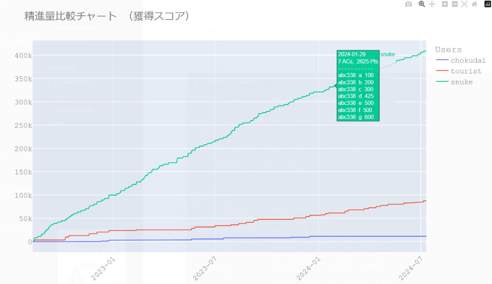

# AtCoder精進比較チャート

自分とライバルの精進量の比較ができます。 精進してライバルに差をつけましょう！

## 使い方

### Google Colaboratoryで実行する方法（推奨）

1. リンククリックで[ノートブック](https://colab.research.google.com/github/A-tilol/atcoder-shojin-chart/blob/main/chart.ipynb)をColabで開く
2. 右上の「接続」ボタンを押し、インスタンスを起動する
3. ノートブックに書かれている説明にしたがって実行する

- チャートにカーソルを当てるとその日のサマリーが表示されます。

### ローカルで実行する方法

1. リポジトリをクローンする
2. poetryで依存関係をインストールする
3. chart.pyまたはchart.ipynbを実行する

## 注意点

※[kenkooooさんのAPI](https://github.com/kenkoooo/AtCoderProblems/blob/master/doc/api.md)を使わせていただいています。ありがとうございます。過度なリクエストは避け感謝しながら使いましょう。本プログラムでは1リクエストにつき1秒のスリープを入れています。

※リクエスト制限のためライバルが多い場合や期間が長い場合にチャート表示に時間がかかる場合があります。
